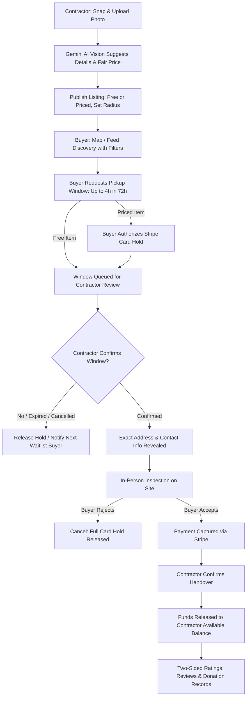

# Salvage — Local Building Material Exchange

> **Building materials, another life.**  
> A full-stack marketplace connecting renovators, contractors, and DIYers to exchange, sell, or donate reusable building materials from renovation sites before they reach a dumpster.

[](https://nextjs.org/)
[](https://react.dev/)
[](https://www.typescriptlang.org/)
[](https://tailwindcss.com/)
[](https://supabase.com/)
[](https://stripe.com/)
[](https://ai.google.dev/)
[](https://leafletjs.com/)
[](https://pglite.dev/)

---

## Table of Contents

- [Overview & Problem Statement](#overview--problem-statement)
- [Transaction Lifecycle](#transaction-lifecycle)
- [Key Features](#key-features)
  - [Contractor Workspace](#contractor-workspace)
  - [Buyer Workspace](#buyer-workspace)
  - [Trust, Safety & Moderation](#trust-safety--moderation)
- [Technology Stack](#technology-stack)
- [Project Architecture & Directory Structure](#project-architecture--directory-structure)
- [Database Schema & Migrations](#database-schema--migrations)
- [Getting Started](#getting-started)
  - [Prerequisites](#prerequisites)
  - [Installation](#installation)
  - [Environment Variables](#environment-variables)
  - [Local Development](#local-development)
- [Testing Suite](#testing-suite)
- [Deployment](#deployment)
- [Roadmap](#roadmap)
- [License](#license)

---

## Overview & Problem Statement

Construction and renovation waste represents one of the largest municipal waste streams in the world. The U.S. Environmental Protection Agency (EPA) estimated that the United States generated **600 million tons** of construction and demolition debris in 2018, with nearly **145 million tons sent directly to landfills**. A substantial portion of this debris consists of perfectly sound architectural salvage: solid wood doors, cabinets, porcelain fixtures, tile overages, lumber, and vintage hardware.

However, saving reusable building materials on an active job site is fraught with friction:
- **For contractors**: Cataloging, describing, pricing, and coordinating collections on busy job sites is time-consuming. Unreliable buyers and missed pickups disrupt tight renovation schedules.
- **For buyers & DIYers**: Finding quality materials locally means sifting through disconnected classifieds with zero guarantees of condition, no escrow protection, and vague pickup logistics.

**Salvage** bridges this divide by providing:
1. **AI-powered listing creation**: Instant photo analysis to suggest titles, categories, condition assessments, and resale valuations.
2. **Explicit pickup window agreements**: Scheduled arrival windows (up to 4 hours within 72 hours) with mandatory contractor confirmation.
3. **Escrow-style payment holds**: Stripe Checkout card authorizations that are *only captured* after in-person buyer inspection and acceptance.
4. **Guaranteed privacy & accountability**: Row-Level Security hides contractor addresses until pickup windows are agreed, backed by a tested no-show cooldown and moderation system.

---

## Transaction Lifecycle

Salvage enforces a verified, sequential transaction flow in PostgreSQL to protect both parties:



---

## Key Features

### Contractor Workspace

- **AI Vision Assistance (Google Gemini & OpenAI fallback)**:
  - Upload or capture on-site photos; Gemini Vision analyzes the item to extract title, material, category, visible condition, and fair resale price.
  - Full manual override for title, description, and pricing.
- **Condition & Testing Transparency**:
  - Structured testing declarations: `Tested & Working`, `Untested`, or `For Parts Only`.
  - Field notes for observed defects and functional testing.
  - Mandatory extra evidence photo and test notes for listings priced at $\ge \$250$ or sellers with upheld reports.
- **Listing Flexibility**:
  - Price items for sale or offer them for free.
  - Contractor-selected discovery radius controls local visibility.
- **Pickup Window Management**:
  - Review requested buyer windows; confirm, extend the window duration (preserving the original start time), or cancel.
- **Earnings & Manual Payouts**:
  - Track gross sales, available balance, pending withdrawals, and payout history.
  - Submit payout requests for manual disbursement via ACH, Stripe, PayPal, or Zelle.
- **1-Click Tax Donation Records**:
  - Auto-generate downloadable donor-entered estimated value records for nonprofit material donations.

### Buyer Workspace

- **Interactive Material Map (Leaflet & OpenStreetMap)**:
  - Visual discovery with selectable pins and dynamic clustering for shared approximate locations.
  - Distance filters (5, 10, 25, 50, and 100 miles) and category filters.
  - Automatic fallback if external map tiles are unreachable.
- **In-App Discovery Alerts**:
  - Buyers configure preferred categories and notification radii; in-app polling alerts buyers within ~15 seconds of new matching listings.
- **Pickup Scheduling & Reservations**:
  - Request pickup windows up to 4 hours long within the next 72 hours.
  - Maximum 2 active reservations per buyer to prevent hoarding.
- **Waitlist Queue**:
  - When an item is reserved, competing buyers can join a waitlist queue; if the reservation expires or cancels, the next buyer is immediately notified.
- **Stripe Checkout with Manual Capture**:
  - Authorize a card hold via Stripe Checkout; funds are **never captured** until the buyer physically inspects and confirms acceptance on site.
  - Immediate hold release if the buyer cancels or declines the item.
- **Verified Pickup Pass & Receipts**:
  - Live pickup pass with real-time countdown, payment status, and contractor contact details.
  - Print-ready and downloadable PDF receipts generated directly in the browser.

### Trust, Safety & Moderation

- **Row-Level Security (RLS)**:
  - Exact pickup addresses, gate codes, and contractor phone numbers are strictly concealed from public API responses. Details are only exposed to authenticated participants with a confirmed reservation.
- **Two-Sided Ratings & Reviews**:
  - Available exclusively to confirmed transaction participants after successful handover.
- **Reporting & Moderation Panel (`/reports`)**:
  - File reports for missing items, misrepresented condition, unsafe behavior, or no-shows.
  - Administrative interface to inspect reports, review photo evidence, issue binding decisions, and process appeals.
- **Enforced No-Show Cooldown**:
  - Two upheld no-show reports within 30 days trigger an automatic 48-hour reservation cooldown.
  - Unconfirmed pickup windows cannot be reported as no-shows.
- **Automatic Discovery Takedowns**:
  - Listings with qualifying upheld reports are automatically hidden from public search and maps.

---

## Technology Stack

| Layer | Technology | Description |
| :--- | :--- | :--- |
| **Frontend Framework** | [Next.js 16 (App Router)](https://nextjs.org/) | Modern server-rendered and client components with React 19 |
| **Language** | [TypeScript 5.9](https://www.typescriptlang.org/) | Strict static typing across API routes, UI components, and test suites |
| **Styling & UI** | [Tailwind CSS v4](https://tailwindcss.com/), Radix / Base UI | High-performance styling, Lucide icons, custom responsive dashboards |
| **Database & Auth** | [Supabase](https://supabase.com/) (PostgreSQL 15+) | RLS policies, Auth with email confirmation, Private Storage buckets, pg_cron |
| **AI Vision Engine** | [Google Gemini Vision](https://ai.google.dev/) | Structured multi-modal analysis for title, category, condition & pricing (OpenAI fallback) |
| **Payments** | [Stripe](https://stripe.com/) | Stripe Checkout with manual authorization, capture upon inspection, webhook synchronization |
| **Maps & Geolocation** | [Leaflet](https://leafletjs.com/) & [OpenStreetMap](https://www.openstreetmap.org/) | Geocoding with Nominatim, interactive marker maps, haversine distance queries |
| **Database Testing** | [PGlite](https://pglite.dev/) | In-memory PostgreSQL instance for rapid, isolated schema and migration testing |
| **Code Quality** | [Oxlint](https://oxc.rs/) & [Oxfmt](https://oxc.rs/) | Blazing-fast Rust-based linting and code formatting |

---

## Project Architecture & Directory Structure

```text
Salvage/
├── app/                              # Next.js App Router
│   ├── api/                          # Backend API Route Handlers
│   │   ├── auth/                     # Session handling & authentication callbacks
│   │   ├── location/                 # Geocoding & coordinate queries
│   │   ├── payments/                 # Stripe checkout, capture & webhook reconciliation
│   │   ├── photos/                   # Private photo serving with signed token validation
│   │   ├── pickups/                  # Pickup window booking, confirmation, extension & handover
│   │   └── salvage/                  # Gemini/OpenAI vision analysis & listing operations
│   ├── buyer/                        # Buyer dashboard, saved searches & active claims
│   ├── contractor/                   # Contractor workspace, listings, earnings & payouts
│   ├── dashboard/                    # Unified activity & transaction feeds
│   ├── listings/                     # Dynamic listing detail pages
│   ├── pickups/                      # Interactive pickup pass & inspection interfaces
│   ├── receipts/                     # Live receipts & downloadable PDF pass generators
│   ├── reports/                      # Admin trust & safety moderation queue
│   ├── layout.tsx                    # Root application layout & metadata
│   └── page.tsx                      # Landing page with interactive search & map
├── components/                       # Shared UI components (shadcn/ui & custom)
├── db/                               # Database client configurations & helpers
├── lib/                              # Server utilities, Stripe client, Supabase SSR helpers
├── public/                           # Static assets & icons
├── scripts/                          # Migration runners & automated PGlite test suites
│   ├── test-database.mjs             # Schema constraints, roles, claims, atomic alerts
│   ├── test-payments.mjs             # Stripe hold, manual capture, payout calculations
│   ├── test-pickups.mjs              # Window booking, contractor confirmation, waitlist
│   ├── test-security.mjs             # RLS policies, webhook signatures, safe receipts
│   └── upgrade-*.mjs                 # Migration automation utilities
└── supabase/
    └── migrations/                   # Ordered SQL schema migrations (0001 - 0008)
```

---

## Database Schema & Migrations

Database migrations are stored in [supabase/migrations/](file:///c:/Users/STADIUM%20B%20C/Demola/Salvage/supabase/migrations/) and must be executed in order:

| # | Migration File | Description |
| :---: | :--- | :--- |
| **0001** | `202609090001_salvage.sql` | Core schema: user profiles, immutable roles (`contractor`/`buyer`), listings, notifications, private storage bucket with RLS. |
| **0002** | `202609090002_optional_profile_coordinates.sql` | Nullable coordinates pair constraint allowing profile saves when geocoding is unavailable. |
| **0003** | `202609090003_add_listing_price.sql` | Adds numeric price column and Stripe checkout session tracking to listings. |
| **0004** | `202609090004_add_payout_requests.sql` | Payout request queue supporting contractor balance withdrawals (ACH, PayPal, Stripe, Zelle). |
| **0005** | `202609090005_payment_integrity.sql` | Escrow hold & capture state machine, verified orders table, webhook idempotency, and balance isolation. |
| **0006** | `202609110006_pickup_protection.sql` | 72-hour pickup windows, waitlist queue, condition & testing declarations, ratings, moderation reports, and 48-hour no-show cooldowns. |
| **0007** | `202609150007_listing_radius.sql` | Contractor-selected listing discovery radius, coordinate grouping, and buyer alert preference matching. |
| **0008** | `202609150008_pickup_confirmation.sql` | Enforced contractor pickup window confirmation, window extension mechanics, and unconfirmed no-show protection. |

---

## Getting Started

### Prerequisites

- **Node.js**: `v22.x` or `v24.x` (specified in `package.json` engines)
- **Package Manager**: `pnpm` (version 11+)
- **Supabase Project**: Free tier PostgreSQL database with Auth and Storage enabled
- **Stripe Account**: Standard test account for payments and webhooks
- **Google AI Studio Key**: Free Gemini API Key (or OpenAI API Key)

### Installation

1. Clone the repository:
   ```bash
   git clone https://github.com/Elijah-Ajadi/Salvage.git
   cd Salvage
   ```

2. Install dependencies:
   ```bash
   pnpm install
   ```

### Environment Variables

Copy `.env.example` to `.env.local` and provide your credentials:

```bash
cp .env.example .env.local
```

Key environment variables:

```ini
# Application URL
NEXT_PUBLIC_APP_URL=http://localhost:3000

# AI Vision Service (Gemini recommended)
GEMINI_API_KEY=your_gemini_api_key
# Optional fallback:
# OPENAI_API_KEY=your_openai_api_key
# OPENAI_VISION_MODEL=gpt-4.1-mini

# Supabase Credentials
NEXT_PUBLIC_SUPABASE_URL=https://your-project.supabase.co
NEXT_PUBLIC_SUPABASE_PUBLISHABLE_KEY=your_publishable_key
SUPABASE_SERVICE_ROLE_KEY=your_service_role_key

# Stripe (Test or Live)
STRIPE_PUBLISHABLE_KEY=pk_test_...
STRIPE_SECRET_KEY=sk_test_...
STRIPE_WEBHOOK_SECRET=whsec_...

# Trust & Safety
ADMIN_USER_IDS=uuid1,uuid2
CRON_SECRET=your_secret_cron_token
```

Verify your environment configuration at any time:
```bash
pnpm check:env
```

### Local Development

Start the development server:

```bash
pnpm dev
```

Open [http://localhost:3000](http://localhost:3000) in your browser to interact with the application.

### Available Scripts

| Command | Action |
| :--- | :--- |
| `pnpm dev` | Start Next.js development server on port 3000 |
| `pnpm build` | Create optimized production build |
| `pnpm start` | Start production server |
| `pnpm test` | Run complete automated PGlite test suite |
| `pnpm typecheck` | Run TypeScript compiler validation without emitting files |
| `pnpm lint` | Run ultra-fast Oxlint check |
| `pnpm format` | Run Oxfmt code formatter |
| `pnpm check:env` | Validate that all required environment variables are set |
| `pnpm setup:smtp` | Configure custom Gmail SMTP for Supabase Auth confirmation emails |

---

## Testing Suite

Salvage includes an extensive, zero-dependency automated test suite using **PGlite** (in-memory embedded WebAssembly PostgreSQL) that validates database integrity and edge cases without needing a remote database connection:

```bash
pnpm test
```

The test runner executes four comprehensive suites:

1. **`test-database.mjs`**:
   - Validates initial schema creation and coordinate constraints.
   - Asserts role immutability (users cannot switch between `contractor` and `buyer`).
   - Ensures single-winner atomic claiming and atomic notification delivery.
   - Enforces direct-data denial via RLS and private photo storage bucket policies.

2. **`test-payments.mjs`**:
   - Tests Stripe Checkout manual authorization holds and capture triggers.
   - Verifies webhook idempotency and replay-attack resistance.
   - Confirms contractor earnings balance calculations and withdrawal limit protections.

3. **`test-pickups.mjs`**:
   - Validates pickup window reservations (up to 4 hours within 72 hours).
   - Tests mandatory contractor window confirmation and window extension rules.
   - Confirms waitlist queue advancement when reservations cancel or expire.
   - Ensures unconfirmed windows cannot be penalized as no-shows.

4. **`test-security.mjs`**:
   - Asserts Row Level Security prevents buyers from seeing unconfirmed pickup addresses.
   - Validates signed photo access tokens.
   - Verifies Stripe webhook signature authentication and safe receipt generation.

---

## Deployment

Salvage is optimized for deployment on **Vercel** with **Supabase**.

For detailed, step-by-step instructions on configuring production environment variables, database cron jobs (`pg_cron`), and Stripe webhook endpoints, refer to [DEPLOYMENT.md](file:///c:/Users/STADIUM%20B%20C/Demola/Salvage/DEPLOYMENT.md).

Quick summary:
1. Push your repository to GitHub.
2. Import the project into Vercel (Next.js preset, Node.js 22.x).
3. Set environment variables from your `.env.local` into Vercel Project Settings.
4. Add your Vercel deployment URL to the Supabase Auth Redirect URLs.
5. Register your production Stripe webhook URL (`https://your-domain.com/api/payments/webhook`).

---

## Roadmap

- [ ] **Automated Contractor Payouts**: Direct automated bank disbursements via Stripe Connect Custom / Express onboarding.
- [ ] **Nonprofit Integration**: Direct partnership integration for certified 501(c)(3) tax acknowledgment receipts.
- [ ] **Contractor License Verification**: State-level license number lookup and badge verification.
- [ ] **Real-Time Direct Messaging**: Built-in chat channel for pickup coordination and logistics updates.
- [ ] **Local Delivery & Hauling**: Integration with local on-demand hauling services for heavy materials (lumber, appliances, stone).
- [ ] **Material Impact Analytics**: Verified calculations measuring diverted landfill tonnage and CO₂ emissions saved.

---

## License

This project is licensed under the MIT License.
